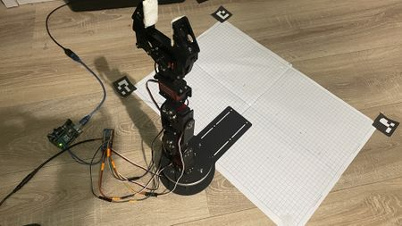
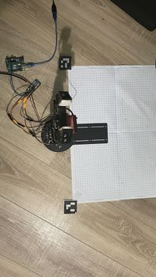
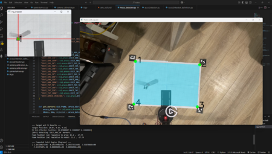
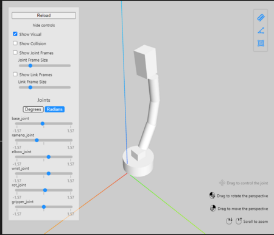
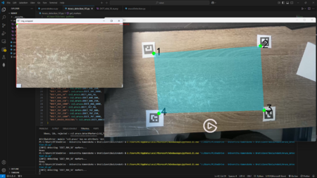
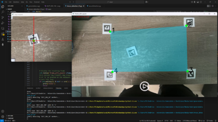

# Camera Controlled Robot Arm

A 6DOF robot arm controlled via computer vision (OpenCV). The system detects a target object and the working area using ArUco markers, computes its coordinates, and moves the robot arm to pick it up and place it on the mirrored side of the working area.

> **Status: work not fully working.** Camera-based object detection and coordinate tracking work correctly, but the robot arm's physical movement (inverse kinematics execution / motor control) does not work reliably. I no longer have access to the physical robot, so I'm unable to continue debugging or fixing the movement issues. Uploading this project as-is for reference.

## Project Goal

Control a 6DOF robot arm using a camera and OpenCV. The robot picks up an object and places it on the opposite side of the working area, where coordinates are mirrored.

## Parts Used

- Arduino Uno
- Servo driver PCA9685
- 6x TD-8135MG servos
- Mobile phone used as the camera for detection

## How it works

1. Build a robot arm controlled by an Arduino
2. Write a URDF file describing the robot
3. Set up camera-based detection
4. Move the robot according to coordinates extracted from the camera feed

### Camera Detection

OpenCV's built-in ArUco markers are used to define the working space and the target object.

1. **Generate markers** — `generateAruco.py` generates 4x 4x4 ArUco markers (IDs 1–4) to define the corners of the working area, and one 6x6 marker for object detection (a different marker type was chosen for the object for easier recognition). Markers are then printed.

2. **Define the working space** — the physical working area was a grid of paper sheets (4x 1cm grid sheets glued together, 37 cm x 54 cm) used for coordinate validation. In `Aruco_detection.py`, pixel coordinates from the detected object marker are converted to real-world centimeters relative to the working area:

   ```python
   if keyboard.is_pressed('p'):
       x_coordinate = (1 - (centerCorner[0][1] / h)) * 37  # Convert pixels to cm
       y_coordinate = ((centerCorner[0][0] / w) * 54) - 27
       print("Object Position (cm) relative to area:", round(x_coordinate, 2), ",", round(y_coordinate, 2))
       compute_ik_for_target([x_coordinate / 100, -y_coordinate / 100, 0.25])
   ```

   (Note: X and Y axes are flipped relative to the physical robot/URDF setup, since it was easier to flip axes in code than to rewrite the robot assembly and URDF file.)

3. **Camera calibration** — a chessboard pattern was used to calibrate the camera. 10 photos from different angles/positions were taken and processed with `camera_calibration.py`, producing calibration data in `camera_calibration_data.npz`.

## Known issues

- Object and working-area detection via ArUco markers works correctly.
- Robot arm movement (inverse kinematics execution on the physical servos) is unreliable and was never fully resolved.
- The project is no longer actively maintained since the physical robot is no longer available for testing.

## Project structure

```
robot/
├── Aruco_detection.py            # main camera/marker detection loop
├── ArucoDetection_definitions.py # marker dictionaries and helper functions
├── camera_calibration.py         # camera calibration script
├── camera_calibration_data.npz   # calibration output
├── generateAruco.py              # ArUco marker generation
├── IK.py                         # inverse kinematics for the arm
├── arm_urdf.urdf                 # robot description (URDF)
├── arucoMarkers/                 # generated marker images
├── calibration_images/           # chessboard photos used for calibration
└── controler/                    # Arduino / servo control code
```

## Photos








## Video

[](https://www.youtube.com/watch?v=VByAehOQuj0)

## Author

Adrian Bartoš
